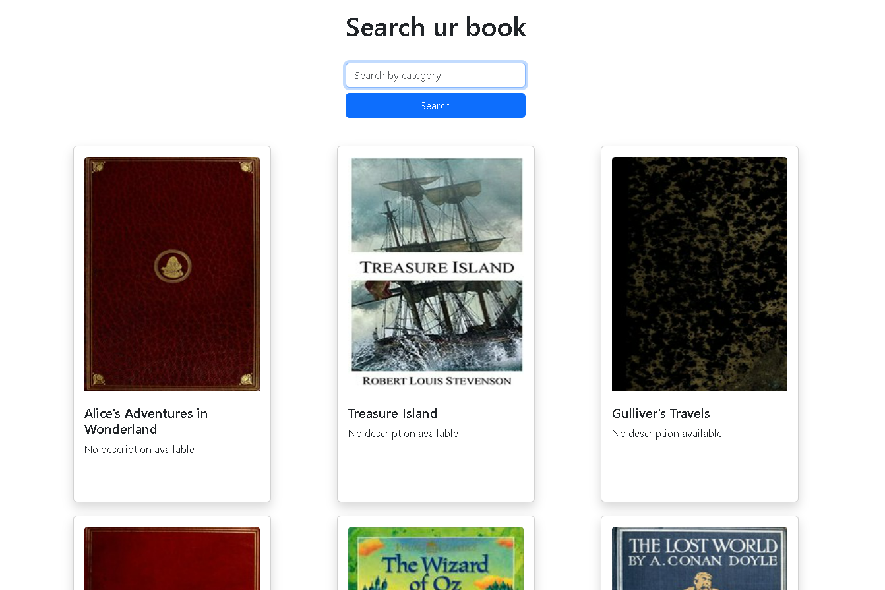

<a href="https://srcurbook.netlify.app/">Click Here!</a>

## About The Project

This web application enables users to search books by category. Users can choose from a wide range of categories such as fiction, nonfiction, science fiction, education, personal development, etc. After selecting a category, the app displays a list of books related to the selected category. Users can explore details about each book, including the title, author, description, cover, and purchase link. The app also allows users to sort books based on price, title, or author. Additionally, the app provides suggestions of similar or recommended books for the selected category.

## Coding

To developed this website I used:

### Languages

- HTML
- CSS
- [SASS](https://sass-lang.com)
- JavaScript

### Libraries

- [Axios](https://axios-http.com/)
